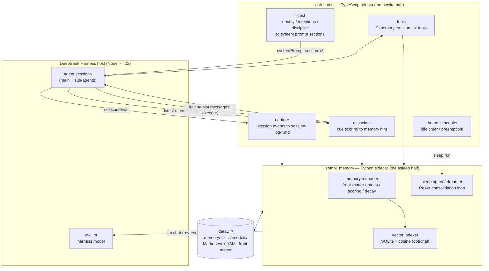

# dsh-somni

**Sleep-consolidated long-term memory for [DeepSeek Harness](https://github.com/deepseek-ai/deepseek-harness) agents.**

[中文说明](./README.zh.md) · [Design notes](./docs/design.md) · MIT

`dsh-somni` gives a DSH agent a memory that works the way people's does: it
**remembers while awake** (identity and open intentions stay resident in the
system prompt, relevant memories surface on their own at action time, and the
model can recall deliberately with tools) and **consolidates while asleep**
(when the agent has been idle for a while, a "dreamer" distills the day's
session logs into episodic, semantic, prospective and procedural memory).

Everything is plain Markdown + YAML front-matter on disk — you can read, edit,
grep and version your agent's memory with ordinary tools.

## Architecture



The two halves talk over a single stdio ndjson JSON-RPC link (`rpc.py`): TS →
Python for `session.*` / `assoc.*` / `tools.*` / `sleep.*`, and — while
dreaming — Python → TS `llm.chat`, so consolidation reuses the harness model
with zero extra API keys. Any request that would print to stdout breaks the
protocol, which is invariant #1 of the design (see `docs/HANDOFF.md`).

## Inputs / Outputs / Dependencies

### Inputs — what the plugin consumes

| Input | Source | Notes |
|---|---|---|
| Session events | DSH `session/event` hook | user/model/tool messages, buffered and drained on `session/flush` / `turn/end`; sub-agent sessions skipped |
| Cues for association | `agent/pre-step` (latest user message) and `tools/post-execute` (tool name + args) | scored against knowledge / skills / episodes; hint injected only above the confidence floor (0.52) with a 0.04 gap to the runner-up |
| Tool schemas | Python function signatures + Google-style docstrings | generated at startup by `toolspec.py`; the docstring *is* the tool description |
| Harness model | `ctx.llm.stream` + `ctx.agentDefaultModel.currentSelection()` | used by the dreamer when `dream.llm: host` (default) |
| Config | `cordis.yml` / `examples/cordis.patch.yml` | every key optional; see the table below |
| Embedding model (optional) | local ONNX dir or an OpenAI-compatible `/embeddings` endpoint | without it the plugin logs once and runs keyword-only |

### Outputs — what the plugin produces

| Output | Where the model sees it | Persistence |
|---|---|---|
| Resident prompt sections | system prompt, 3 sections (identity / intentions / discipline), refreshed on agent create, before each admitted step, after dreams and intention tools | nothing written |
| Associative hints | appended `UserMessage` (pre-step) or `additionalContexts` (post-execute) | nothing written |
| Memory tools | 9 tools on `ctx.tools`: `recall_memories`, `search_episodes`, `search_recent_conversation`, `search_knowledge`, `add_intention`, `complete_intention`, `cancel_intention`, `list_intentions`, `dream_now` | results are Markdown |
| Session logs | one file per session under `memory/session-log/` | Markdown, front-matter per session |
| Dream products | episodic / semantic (knowledge) / prospective (intentions) / procedural (skills) entries + profile deltas + decay passes + `dreams/` run log | Markdown + YAML front-matter under `dataDir` |
| Skill files | distills `skills/agent_learned_skills/*/SKILL.md` | point `dsh-skill-filesystem` at the directory to load them |

### Dependencies

| Layer | Requirement | Fallback if missing |
|---|---|---|
| Runtime | DeepSeek Harness `>= 0.2.0-rc.1` (peer deps: `dsh-agent`, `dsh-session`, `dsh-llm`, `dsh-tools`, `dsh-system-prompt`, `dsh-subprocess`, `dsh-agent-default-model`, `dsh-home-paths`), Node `>= 22` | — |
| Sidecar | Python `>= 3.9` on `PATH` (configurable via `python`) | plugin degrades gracefully; capture/dream stop, nothing crashes |
| Python packages (core) | **none** — stdlib only | — |
| Vector layer (optional) | `onnxruntime >= 1.16`, `tokenizers >= 0.15`, `numpy >= 1.24`, plus `bge-small-zh-v1.5` ONNX + tokenizer under `models/` | keyword-only scoring; associative hints stay silent |
| `dream.llm: openai` (optional) | `openai` pip package + an OpenAI-compatible endpoint | use the default `host` mode instead |
| Build/dev | TypeScript `>= 5.6`, pytest | — |

## What the agent gets

| Memory kind | Where it lives | How it reaches the model |
|---|---|---|
| Identity — `about_me.md`, `about_user.md`, per-user profiles | `memory/` | Resident system-prompt section |
| Prospective — intentions with cue / due time | `memory/intentions/` | Resident section (due & cue-matched first); intention tools |
| Episodic — what happened, when, how it went | `memory/episodes/` | `search_episodes`, `recall_memories`; associative hints |
| Semantic — facts, decisions, pitfalls, preferences | `memory/knowledge/` | `search_knowledge`, `recall_memories`; associative hints |
| Procedural — distilled skills (`SKILL.md`) | `skills/agent_learned_skills/` | `dsh-skill-filesystem` directory; associative hints |
| Working — the current conversation | `memory/session-log/` | `search_recent_conversation` |

Associative hints are System-1: a cue is scored against knowledge / skills /
episodes with a hybrid keyword+vector score; a hint is injected only when the
top hit clears an absolute floor (`0.52`) **and** stands clear of the runner-up
(`0.04` gap), with per-session habituation so the same memory is never repeated.
With the vector layer off the hooks stay silent.

## The memory core: activation, strengthening, forgetting

Every memory file carries five front-matter numbers that drive its life
cycle: `score` (current activation, 0–1), `stability` (how well it is
consolidated), `salience` (importance assigned at write time), `last_used`
and `last_decay`.

**Writing.** Episodes start with a salience→score mapping (low 0.4, mid 0.6,
high 0.8) on the *fast* curve; knowledge and skills start on the *slow*
curve. Prospective memory (intentions) is exempt from decay entirely — the
Zeigunik effect: an open intention stays active until it is completed or
cancelled, and only a due-date window (3 days) controls when it is
proactively raised.

**Strengthening — spaced repetition.** Every recall or re-confirmation calls
`record_usage`: on a new day `stability += 1` and `score += 0.2`; same-day
repeats add only `0.05` — massed repetition earns less than spaced
repetition.

**Forgetting — two curves.** Decay runs once per dream across all entries:

```
daily_decay = 1 − base / (1 + stability × 0.5)
score      *= daily_decay ^ days_since_last_decay
```

* Semantic memories (knowledge, skills): `base = 0.1` — slow, and every use
  flattens the curve further.
* Episodic memories: `base = 0.25` — an episode that is never recalled again
  fades out in roughly 1–2 weeks.
* Flashbulb effect: high-salience episodes decay at `base × 0.4`, mid at
  `base × 0.7`.

**Retirement, not deletion.** When `score < 0.2` the entry is moved to
`archived/` (episodes to `episodes/archived/`) — nothing is destroyed; the
file stays greppable and a later dream may promote it back.

**Recall scoring.** `recall_memories` and the associative hints share one
hybrid scorer: `0.6 × normalized cosine + 0.4 × keyword overlap`, plus a
`+0.2` literal-hit boost; candidates are gated by a cosine noise floor
(0.40), related memories one hop away join at 0.6 of their seed's score, and
ties are broken by the entry's own activation `score`. Semantic search runs
in hybrid mode only when the vector layer is up — otherwise it falls back to
keyword-only with a looser tokenizer to keep recall.

## Install

One command (requires an existing DSH install, node >= 18, python >= 3.9):

```bash
git clone https://github.com/liuqingman/dsh-somni.git
cd dsh-somni
./install.sh                  # installs into the "default" profile
./install.sh --profile mybot  # or any profile under $DSH_HOME/profiles
```

The installer pip-installs the sidecar, links the plugin into your profile's
`node_modules`, merges a ready-made config into the profile's
`cordis.patch.yml`, and pings the sidecar over stdio to verify. It is
idempotent — safe to re-run.

See [`examples/cordis.patch.yml`](./examples/cordis.patch.yml) for every
option with its default. Optional vector layer (semantic recall +
associative hints):

```bash
python3 -m pip install "somni-memory[embed]"
# then drop BAAI/bge-small-zh-v1.5 ONNX files into ~/.dsh/somni/models/
# and set embed.provider: local
```

For local embeddings put `model.onnx` + `tokenizer.json` of
`BAAI/bge-small-zh-v1.5` (or any sentence-embedding model with the same
layout) under `~/.dsh/somni/models/bge-small-zh-v1.5/`, or set `embed.modelDir`.
Without a model the plugin logs once and runs keyword-only.

## Configuration

| Key | Default | Meaning |
|---|---|---|
| `dataDir` | `<DSH_HOME>/somni` | `memory/`, `skills/`, `models/` live here |
| `python` | `python3` | Interpreter for the sidecar |
| `capture.enabled` / `maxMessageChars` | `true` / `4000` | Write session-logs; per-message cap |
| `inject.identity` / `intentions` / `discipline` | `true` | Resident prompt sections (orders 100 / 130 / 1200) |
| `assoc.enabled` / `preStep` / `postExecute` | `true` | Associative hints on the latest message / after tool calls |
| `assoc.threshold` / `gap` / `maxItems` | `0.52` / `0.04` / `2` | Confidence gate |
| `tools.enabled` | `true` | Register the memory tools (+ `dream_now`) |
| `dream.enabled` | `true` | Scheduled consolidation |
| `dream.idleMs` / `maxIntervalMs` / `minPendingLogs` | `15 min` / `6 h` / `1` | Start after this much quiet, or at least this often while idle |
| `dream.llm` | `host` | `host` = harness model via `ctx.llm`; `openai` = sidecar calls an OpenAI-compatible API (`dream.openai.{baseUrl,apiKeyEnv,model}`) |
| `dream.maxIterations` | `60` | ReAct step cap per dream |
| `embed.provider` | `local` | `local` (ONNX) · `http` (OpenAI-compatible `/embeddings`, `embed.baseUrl`) · `off` |
| `logLevel` | `info` | Sidecar log level (forwarded to the harness logger) |

Dreams are preemptible: if any agent starts a turn mid-dream the sidecar is
told to stop, so the user never waits on consolidation. The `dream_now` tool
forces one from the conversation.

## On-disk format

```
dataDir/
├── memory/
│   ├── about_me.md               # identity (resident prompt)
│   ├── about_user_<id>.md        # per-user profiles
│   ├── intentions/               # prospective memory (cue / due / priority)
│   ├── episodes/                 # what happened, when, how it went
│   ├── knowledge/                # facts, decisions, pitfalls, preferences
│   ├── session-log/              # working memory, one file per session
│   └── dreams/                   # dream run logs
├── skills/
│   └── agent_learned_skills/     # distilled SKILL.md files
├── models/                       # optional ONNX embedding model
└── index.sqlite                  # vector index (derived, safe to delete)
```

Everything under `memory/` and `skills/` is plain Markdown with YAML
front-matter — the SQLite index is a derived cache and can be rebuilt at any
time.

## How it plugs into DSH

* **Capture** — `session/event` → buffered → drained on `session/flush` /
  `turn/end`; `session/disposed` closes the log. Sub-agent sessions are skipped;
  the plugin's own injected hints are never echoed back.
* **Prompt** — `ctx.systemPrompt.section` × 3, cached and refreshed on
  `agent/created`, before each step that admits user input (so intention cues
  match the incoming message), after dreams and after intention tools.
* **Association** — `agent/pre-step` (appends a hint `UserMessage` to the
  admitted batch) and `tools/post-execute` (`additionalContexts`). These are
  the two hooks whose decision types can carry context; `tools/pre-execute`
  cannot and is not used.
* **Tools** — schemas are generated from the Python functions' docstrings and
  registered on `ctx.tools` at startup.
* **Dreaming** — `ctx.agents.list()` idle check + quiet timer; the sidecar's
  `sleep.run` drives a ReAct loop whose LLM calls come back over the RPC link
  as `llm.chat` and are served by `ctx.llm.stream` with
  `ctx.agentDefaultModel.currentSelection()`.
* **Sidecar** — spawned via `ctx.subprocess.spawn` (scrubbed environment variables (env); only
  the keys the config names are forwarded), restarted with backoff on crash,
  shut down gracefully with the plugin.

## Development

```bash
npm install
npm run typecheck
npm test            # python: pytest (unit + real-stdio sidecar smoke) · ts: build + fake-harness e2e
```

`tests/smoke_plugin.mjs` runs the built plugin against a minimal fake harness
context and walks capture → tools → prompt refresh → session close → a full
dream through the host-LLM bridge. `PYTHON=python3.11 node tests/smoke_plugin.mjs`
to pick an interpreter.

Layout: `src/` (plugin), `python/somni_memory/` (memory core + sidecar),
`python/tests/`, `examples/`, `docs/`.

## Origin

The memory core is a decoupled fork of the "work / sleep" memory system built
for the *somni* Feishu agent — same on-disk format, decay curves and
consolidation strategy, minus the platform-specific parts.

## License

MIT
