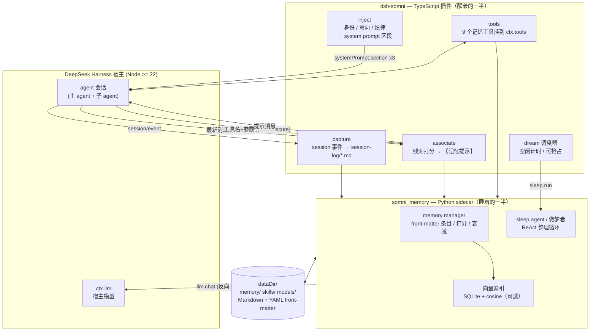

# dsh-somni

**给 [DeepSeek Harness](https://github.com/deepseek-ai/deepseek-harness) 的睡眠整理式长期记忆。**

[English](./README.md) · [设计笔记](./docs/design.md) · [交接文档](./docs/HANDOFF.md) · MIT

`dsh-somni` 让 DSH agent 拥有像人一样的记忆：**醒着时记忆**（身份与未竟意向常驻
system prompt，相关记忆在行动时自动浮现，模型也可以用工具主动回忆），
**睡着时整理**（agent 空闲一段时间后，"做梦者"把当天的 session 日志蒸馏成
情景、语义、前瞻、程序四类记忆）。

所有记忆都是磁盘上的 Markdown + YAML front-matter——可以随时读、改、grep、进版本管理。

## 架构



两半之间只有一条 stdio ndjson JSON-RPC 链路（`rpc.py`）：TS → Python 走
`session.*` / `assoc.*` / `tools.*` / `sleep.*`；做梦期间 Python → TS 反向调
`llm.chat`，于是整理复用宿主模型，零额外 API key。任何往 stdout print 的
代码都会破坏协议——这是设计不变量 #1（见 `docs/HANDOFF.md`）。

## 输入 / 输出 / 依赖

### 输入 —— 插件消费什么

| 输入 | 来源 | 说明 |
|---|---|---|
| 会话事件 | DSH `session/event` 钩子 | 用户/模型/工具消息，`session/flush` / `turn/end` 时落盘；跳过子 agent 会话 |
| 联想线索 | `agent/pre-step`（最新用户消息）与 `tools/post-execute`（工具名+参数） | 与 knowledge / skills / episodes 打分匹配；仅当超过置信下限（0.52）且领先第二名 0.04 以上才注入 |
| 工具 schema | Python 函数签名 + Google 风格 docstring | 启动时由 `toolspec.py` 生成；docstring 即工具描述 |
| 宿主模型 | `ctx.llm.stream` + `ctx.agentDefaultModel.currentSelection()` | `dream.llm: host`（默认）时做梦者使用 |
| 配置 | `cordis.yml` / `examples/cordis.patch.yml` | 所有键均可省略，见下表 |
| Embedding 模型（可选） | 本地 ONNX 目录或 OpenAI 兼容 `/embeddings` 端点 | 缺失时只打一条日志，退回纯关键词检索 |

### 输出 —— 插件产出什么

| 输出 | 模型从哪里看到 | 持久化 |
|---|---|---|
| 常驻 prompt 区段 | system prompt 三段（身份/意向/纪律），在 agent 创建、每个可注入 step 前、做梦后、意向工具后刷新 | 不落盘 |
| 联想提示 | pre-step 追加的 `UserMessage` 或 post-execute 的 `additionalContexts` | 不落盘 |
| 记忆工具 | 挂到 `ctx.tools` 的 9 个工具：`recall_memories`、`search_episodes`、`search_recent_conversation`、`search_knowledge`、`add_intention`、`complete_intention`、`cancel_intention`、`list_intentions`、`dream_now` | 结果为 Markdown |
| 会话日志 | 每会话一个文件，位于 `memory/session-log/` | Markdown + front-matter |
| 做梦产物 | 情景/语义（knowledge）/前瞻（intentions）/程序（skills）条目 + 用户画像增量 + 衰减轮 + `dreams/` 运行日志 | `dataDir` 下 Markdown + YAML front-matter |
| 技能文件 | 蒸馏出 `skills/agent_learned_skills/*/SKILL.md` | 把 `dsh-skill-filesystem` 指向该目录即可加载 |

### 依赖

| 层 | 要求 | 缺失时的降级 |
|---|---|---|
| 运行时 | DeepSeek Harness `>= 0.2.0-rc.1`（peer deps：`dsh-agent`、`dsh-session`、`dsh-llm`、`dsh-tools`、`dsh-system-prompt`、`dsh-subprocess`、`dsh-agent-default-model`、`dsh-home-paths`）、Node `>= 22` | — |
| sidecar | `PATH` 上的 Python `>= 3.9`（可用 `python` 配置） | 插件优雅降级：capture/做梦停摆，但不崩 |
| Python 包（核心） | **无** —— 纯标准库 | — |
| 向量层（可选） | `onnxruntime >= 1.16`、`tokenizers >= 0.15`、`numpy >= 1.24`，加 `bge-small-zh-v1.5` 的 ONNX + tokenizer 放 `models/` | 纯关键词打分；联想提示保持沉默 |
| `dream.llm: openai`（可选） | `openai` pip 包 + OpenAI 兼容端点 | 改用默认 `host` 模式 |
| 构建/开发 | TypeScript `>= 5.6`、pytest | — |

## Agent 得到什么

| 记忆类型 | 存放位置 | 到达模型的路径 |
|---|---|---|
| 身份 —— `about_me.md`、`about_user.md`、分用户画像 | `memory/` | 常驻 system prompt 区段 |
| 前瞻 —— 带 cue / 截止时间的意向 | `memory/intentions/` | 常驻区段（到期与 cue 命中优先）；意向工具 |
| 情景 —— 何时做过什么、结果如何 | `memory/episodes/` | `search_episodes`、`recall_memories`；联想提示 |
| 语义 —— 事实、决策、坑、偏好 | `memory/knowledge/` | `search_knowledge`、`recall_memories`；联想提示 |
| 程序 —— 蒸馏出的技能（`SKILL.md`） | `skills/agent_learned_skills/` | `dsh-skill-filesystem` 目录；联想提示 |
| 工作记忆 —— 当前会话 | `memory/session-log/` | `search_recent_conversation` |

联想提示是 System-1：线索用"关键词+向量"混合分对 knowledge / skills /
episodes 打分；只有最高分越过绝对下限（`0.52`）**且**甩开第二名（`0.04` 间隔）
才注入，并带会话内习惯化——同一条记忆绝不重复出现。向量层关闭时钩子整体静默。

## 安装

```bash
npm i dsh-somni
# 可选：向量层（语义召回 + 联想提示）
python3 -m pip install "onnxruntime>=1.16" "tokenizers>=0.15" "numpy>=1.24"
```

然后把插件加进 `~/.dsh/cordis.yml`——每个选项及默认值见
[`examples/cordis.patch.yml`](./examples/cordis.patch.yml)。最小配置：

```yaml
- name: dsh-somni
- name: '@deepseek-ai/dsh-skill-filesystem'
  config:
    customSkillDirs: [~/.dsh/somni/skills/agent_learned_skills]
```

本地 embedding：把 `BAAI/bge-small-zh-v1.5`（或任何同布局的句子向量模型）的
`model.onnx` + `tokenizer.json` 放到 `~/.dsh/somni/models/bge-small-zh-v1.5/`，
或设置 `embed.modelDir`。没有模型时插件只打一条日志、按纯关键词运行。

## 配置

| 键 | 默认 | 含义 |
|---|---|---|
| `dataDir` | `<DSH_HOME>/somni` | `memory/`、`skills/`、`models/` 所在目录 |
| `python` | `python3` | sidecar 解释器 |
| `capture.enabled` / `maxMessageChars` | `true` / `4000` | 写会话日志；单条消息截断 |
| `inject.identity` / `intentions` / `discipline` | `true` | 常驻 prompt 区段（order 100 / 130 / 1200） |
| `assoc.enabled` / `preStep` / `postExecute` | `true` | 最新消息 / 工具调用后的联想提示 |
| `assoc.threshold` / `gap` / `maxItems` | `0.52` / `0.04` / `2` | 置信门 |
| `tools.enabled` | `true` | 注册记忆工具（含 `dream_now`） |
| `dream.enabled` | `true` | 定时整理 |
| `dream.idleMs` / `maxIntervalMs` / `minPendingLogs` | `15 min` / `6 h` / `1` | 空闲多久后可做梦；空闲期间至少每隔这么久做一次 |
| `dream.llm` | `host` | `host` = 经 `ctx.llm` 复用宿主模型；`openai` = sidecar 自行调 OpenAI 兼容 API（`dream.openai.{baseUrl,apiKeyEnv,model}`） |
| `dream.maxIterations` | `60` | 每次做梦的 ReAct 步数上限 |
| `embed.provider` | `local` | `local`（ONNX）· `http`（OpenAI 兼容 `/embeddings`，`embed.baseUrl`）· `off` |
| `logLevel` | `info` | sidecar 日志级别（转发给 harness logger） |

做梦可抢占：任何 agent 在做梦途中开新回合，sidecar 都会被叫停——用户永远不用等整理。
会话里也可以用 `dream_now` 工具强制做一次。

## 磁盘格式

```
dataDir/
├── memory/
│   ├── about_me.md               # 身份（常驻 prompt）
│   ├── about_user_<id>.md        # 分用户画像
│   ├── intentions/               # 前瞻记忆（cue / due / priority）
│   ├── episodes/                 # 何时做过什么、结果如何
│   ├── knowledge/                # 事实、决策、坑、偏好
│   ├── session-log/              # 工作记忆，每会话一个文件
│   └── dreams/                   # 做梦运行日志
├── skills/
│   └── agent_learned_skills/     # 蒸馏出的 SKILL.md
├── models/                       # 可选 ONNX embedding 模型
└── index.sqlite                  # 向量索引（派生物，可随时删除重建）
```

`memory/` 与 `skills/` 下全部是带 YAML front-matter 的纯 Markdown——
SQLite 索引只是派生缓存，删了会自动重建。

## 如何接入 DSH

* **Capture** —— `session/event` → 缓冲 → `session/flush` / `turn/end` 落盘；
  `session/disposed` 关闭日志。跳过子 agent 会话；插件自己注入的提示不会被回录。
* **Prompt** —— `ctx.systemPrompt.section` × 3，在 `agent/created`、每个允许
  用户输入的 step 之前（让意向 cue 对上即将到来的消息）、做梦之后、意向工具
  之后刷新。
* **Association** —— `agent/pre-step`（向已接纳批次追加提示 `UserMessage`）与
  `tools/post-execute`（`additionalContexts`）。这是仅有的两个决策类型能携带
  上下文的钩子；`tools/pre-execute` 不能，故不用。
* **Tools** —— schema 从 Python 函数的 docstring 生成，启动时注册到 `ctx.tools`。
* **Dreaming** —— `ctx.agents.list()` 空闲检查 + 静默计时器；sidecar 的
  `sleep.run` 驱动 ReAct 循环，其 LLM 调用经 RPC 以 `llm.chat` 回来，由
  `ctx.llm.stream` 按 `ctx.agentDefaultModel.currentSelection()` 伺服。
* **Sidecar** —— 经 `ctx.subprocess.spawn` 启动（清洗过的env；只转发配置
  点名的键），崩溃按退避重启，随插件优雅关闭。

## 开发

```bash
npm install
npm run typecheck
npm test            # python: pytest（单测 + 真 stdio sidecar 冒烟）· ts: build + fake-harness e2e
```

`tests/smoke_plugin.mjs` 用最小 fake harness 上下文跑构建产物，走完
capture → tools → prompt 刷新 → 会话关闭 → 经 host-LLM 桥的完整一次做梦。
用 `PYTHON=python3.11 node tests/smoke_plugin.mjs` 选解释器。

目录：`src/`（插件）、`python/somni_memory/`（记忆核心 + sidecar）、
`python/tests/`、`examples/`、`docs/`。

## 出处

记忆核心是 *somni* 飞书 agent「工作/睡眠」记忆系统的解耦 fork——同样的磁盘
格式、衰减曲线与整理策略，去掉平台相关的部分。

## 许可

MIT
